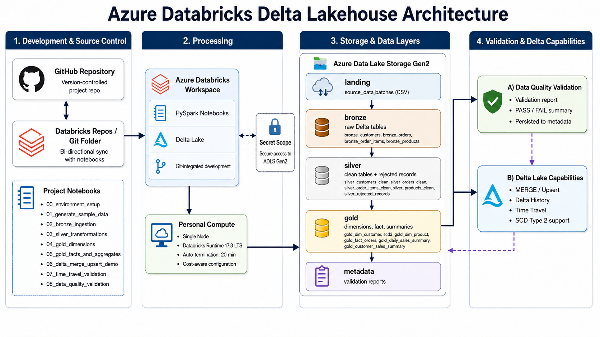

<p align="center">
  
</p>

<p align="center">
  <h1>Azure Databricks Delta Lakehouse </h1>
</p>

Portfolio-ready Azure Databricks project that implements a Delta Lakehouse architecture using PySpark, ADLS Gen2, Delta Lake, and a Bronze/Silver/Gold data processing pattern.

The project demonstrates how raw CSV source files can be transformed into validated, versioned, and analytics-ready Delta tables using Azure Databricks.

## Project Overview

This project was built to demonstrate practical Data Engineering patterns commonly used in modern Lakehouse platforms.

It covers:

* Azure Databricks notebook execution
* ADLS Gen2 storage layers
* Bronze/Silver/Gold Lakehouse architecture
* PySpark transformations
* Delta Lake tables
* Schema evolution handling
* Data quality validation
* Rejected records handling
* SCD Type 2 customer history
* Gold dimensional modeling
* Fact and summary tables
* Delta MERGE / upsert
* Delta history
* Delta time travel
* Persisted validation reports
* GitHub and Databricks Git Folder integration
* Cost-aware compute configuration

The project is intentionally scoped as a portfolio-ready MVP, not as a fully productionized enterprise Lakehouse platform.

## Architecture



The solution uses Azure Databricks as the processing layer and Azure Data Lake Storage Gen2 as the Lakehouse storage layer.

High-level architecture:

```text
GitHub Repository
      ↔
Databricks Git Folder
      ↓
Azure Databricks Workspace
      ↓
Personal Compute / PySpark / Delta Lake
      ↓
ADLS Gen2
  ├── landing
  ├── bronze
  ├── silver
  ├── gold
  └── metadata
```

## Lakehouse Data Flow


The project follows a Bronze/Silver/Gold Lakehouse pattern.

```text
Source CSV files
      ↓
Landing zone
      ↓
Bronze raw Delta tables
      ↓
Silver clean tables + rejected records
      ↓
Gold dimensions, facts, and summaries
      ↓
Validation report persisted to metadata
```

## Delta Lake Capabilities


The project demonstrates key Delta Lake capabilities through the Gold product dimension:

* Delta MERGE / upsert
* Transaction history
* Versioned reads
* Time travel validation
* Before/after comparison

MERGE scenario:

```text
PROD-002 → existing product updated
PROD-005 → new product inserted
```

Expected result:

```text
Before MERGE → 4 products
After MERGE  → 5 products
```

## Technology Stack

| Area                   | Technology                      |
| ---------------------- | ------------------------------- |
| Cloud platform         | Microsoft Azure                 |
| Processing             | Azure Databricks                |
| Language               | Python                          |
| Distributed processing | PySpark                         |
| Table format           | Delta Lake                      |
| Storage                | Azure Data Lake Storage Gen2    |
| Source control         | GitHub                          |
| Development workflow   | Databricks Git Folder + VS Code |
| Validation             | PySpark validation notebook     |
| Security               | Databricks-backed secret scope  |
| Compute                | Databricks Personal Compute     |

## Repository Structure

```text
azure-databricks-delta-lakehouse/
├── diagrams/
│   ├── 01_lakehouse_architecture.png
│   ├── 02_bronze_silver_gold_flow.png
│   └── 03_delta_capabilities_flow.png
├── docs/
│   ├── architecture.md
│   ├── lakehouse_design.md
│   ├── source_data_model.md
│   ├── bronze_layer.md
│   ├── silver_layer.md
│   ├── gold_layer.md
│   ├── scd_type_2_design.md
│   ├── delta_merge_upsert.md
│   ├── time_travel_validation.md
│   ├── data_quality_validation.md
│   ├── cost_controls.md
│   ├── known_limitations.md
│   ├── future_improvements.md
│   ├── evidence_index.md
│   ├── implementation_walkthrough.md
│   └── notebook_execution_plan.md
├── evidence/
│   ├── 01_environment_setup/
│   ├── 02_source_data_generation/
│   ├── 03_bronze_layer/
│   ├── 04_silver_layer/
│   ├── 05_gold_dimensions/
│   ├── 06_gold_facts/
│   ├── 07_delta_merge/
│   ├── 08_time_travel/
│   ├── 09_data_quality_validation/
│   └── 10_cost_controls/
├── notebooks/
│   ├── 00_environment_setup.py
│   ├── 01_generate_sample_data.py
│   ├── 02_bronze_ingestion.py
│   ├── 03_silver_transformations.py
│   ├── 04_gold_dimensions.py
│   ├── 05_gold_facts_and_aggregates.py
│   ├── 06_delta_merge_upsert_demo.py
│   ├── 07_time_travel_validation.py
│   └── 08_data_quality_validation.py
├── sample_data/
│   └── README.md
├── .gitignore
├── LICENSE
└── README.md
```

## Notebook Execution Order

The notebooks are designed to run in the following order:

| Step | Notebook                          | Purpose                                                |
| ---: | --------------------------------- | ------------------------------------------------------ |
|    0 | `00_environment_setup.py`         | Configure paths and validate ADLS access               |
|    1 | `01_generate_sample_data.py`      | Generate controlled source CSV batches                 |
|    2 | `02_bronze_ingestion.py`          | Ingest source files into Bronze Delta tables           |
|    3 | `03_silver_transformations.py`    | Clean, type, validate, and reject invalid records      |
|    4 | `04_gold_dimensions.py`           | Build customer SCD2 and product dimensions             |
|    5 | `05_gold_facts_and_aggregates.py` | Build fact table and analytical summaries              |
|    6 | `06_delta_merge_upsert_demo.py`   | Demonstrate Delta MERGE / upsert                       |
|    7 | `07_time_travel_validation.py`    | Validate before/after versions using Delta time travel |
|    8 | `08_data_quality_validation.py`   | Run final validation checks and persist report         |

## Source Data Model

The project uses a controlled retail order dataset generated by notebook.

Source entities:

| Entity        | Description            |
| ------------- | ---------------------- |
| `customers`   | Customer master data   |
| `products`    | Product reference data |
| `orders`      | Order header data      |
| `order_items` | Order line-level data  |

Source batches:

| Batch                        | Purpose                                                  |
| ---------------------------- | -------------------------------------------------------- |
| `batch_001`                  | Initial baseline data                                    |
| `batch_002`                  | Incremental updates, new records, and invalid references |
| `batch_003_schema_evolution` | Schema evolution and additional validation scenarios     |

The generated files are written to:

```text
landing/source_data/
```

Expected source structure:

```text
landing/source_data/
  batch_001/
    customers.csv
    products.csv
    orders.csv
    order_items.csv

  batch_002/
    customers.csv
    orders.csv
    order_items.csv

  batch_003_schema_evolution/
    customers.csv
    orders.csv
    order_items.csv
```

## Bronze Layer

The Bronze layer converts source CSV files into raw Delta tables while preserving source traceability.

Bronze tables:

| Table                | Expected rows |
| -------------------- | ------------: |
| `bronze_customers`   |             9 |
| `bronze_products`    |             4 |
| `bronze_orders`      |            10 |
| `bronze_order_items` |            11 |

Bronze adds technical metadata such as:

* `ingestion_batch_id`
* `source_entity`
* `source_file_path`
* `ingestion_ts`
* `bronze_load_date`
* `raw_record_hash`

The Bronze layer also preserves schema evolution, including the `loyalty_tier` column introduced in `batch_003_schema_evolution`.

## Silver Layer

The Silver layer creates clean, typed, and validated datasets.

Silver clean tables:

| Table                      | Expected rows |
| -------------------------- | ------------: |
| `silver_customers_clean`   |             9 |
| `silver_products_clean`    |             4 |
| `silver_orders_clean`      |             7 |
| `silver_order_items_clean` |             8 |

Rejected records table:

| Table                     | Expected rows |
| ------------------------- | ------------: |
| `silver_rejected_records` |             6 |

Expected rejection summary:

| Entity        | Rejection reason                              | Expected count |
| ------------- | --------------------------------------------- | -------------: |
| `orders`      | `currency_code_is_not_allowed`                |              1 |
| `orders`      | `customer_id_not_found`                       |              1 |
| `orders`      | `order_status_is_not_allowed`                 |              1 |
| `order_items` | `order_id_not_found_or_parent_order_rejected` |              3 |

Silver acts as the quality gate of the Lakehouse.

## Gold Layer

The Gold layer creates analytics-ready dimensions, facts, and summaries.

Gold tables:

| Table                         | Description                                |
| ----------------------------- | ------------------------------------------ |
| `gold_dim_customer_scd2`      | Customer dimension with SCD Type 2 history |
| `gold_dim_product`            | Product dimension                          |
| `gold_fact_orders`            | Order-level fact table                     |
| `gold_daily_sales_summary`    | Daily sales summary by date and currency   |
| `gold_customer_sales_summary` | Customer-level sales summary               |

Expected final Gold counts:

| Table                         | Expected rows |
| ----------------------------- | ------------: |
| `gold_dim_customer_scd2`      |             9 |
| `gold_dim_product`            |             5 |
| `gold_fact_orders`            |             6 |
| `gold_daily_sales_summary`    |             4 |
| `gold_customer_sales_summary` |             6 |

## SCD Type 2 Customer Dimension

The project implements SCD Type 2 on the customer dimension.

Target table:

```text
gold_dim_customer_scd2
```

Tracked attributes:

* `customer_name`
* `email`
* `city`
* `state`
* `customer_segment`
* `loyalty_tier`

Each customer has exactly one current version.

Expected customer version counts:

| Customer   | Expected versions |
| ---------- | ----------------: |
| `CUST-001` |                 2 |
| `CUST-002` |                 2 |
| `CUST-003` |                 2 |
| `CUST-004` |                 1 |
| `CUST-005` |                 1 |
| `CUST-006` |                 1 |

The Gold fact table joins orders to the customer version that was valid at the order timestamp.

## Data Quality Validation

The final validation notebook creates a validation report with expected and actual values.

Notebook:

```text
08_data_quality_validation.py
```

The validation report checks:

* Bronze row counts
* Silver clean table counts
* Rejected record counts
* Gold dimension counts
* Gold fact and summary counts
* Duplicate prevention
* SCD2 current-record rules
* SCD2 effective date consistency
* Delta MERGE results
* Delta history contains MERGE
* Revenue consistency between fact and summary

Final validation result:

```text
PASS: 27
FAIL: 0
```

The report is persisted to:

```text
metadata/delta_lakehouse/validation_reports/
```

## Evidence Package

The repository includes an evidence package with screenshots that prove the project was implemented and executed successfully.

Evidence index:

```text
docs/evidence_index.md
```

Evidence folders:

| Folder | Purpose |
|--------|----------|
| `evidence/01_environment_setup/` | Databricks, compute, Git Folder, and ADLS access |
| `evidence/02_source_data_generation/` | Source data generation |
| `evidence/03_bronze_layer/` | Bronze ingestion and Delta history |
| `evidence/04_silver_layer/` | Silver clean and rejected records |
| `evidence/05_gold_dimensions/` | Gold dimensions and SCD2 |
| `evidence/06_gold_facts/` | Gold facts and summaries |
| `evidence/07_delta_merge/` | Delta MERGE / upsert |
| `evidence/08_time_travel/` | Delta time travel validation |
| `evidence/09_data_quality_validation/` | Final validation report |
| `evidence/10_cost_controls/` | Cost-aware compute configuration |

## Cost Controls

The project was designed with cost control in mind.

Cost-aware decisions:

* Personal Compute
* Single-node configuration
* Auto-termination enabled
* Manual compute termination after work sessions
* No SQL Warehouse used in the MVP
* No Databricks pools used in the MVP
* No scheduled jobs used in the MVP
* Small controlled sample dataset
* Dedicated project resource group
* Dedicated project storage account

The project favors controlled interactive execution over always-on infrastructure.

## Security Notes

Secrets are not stored in notebooks or committed to GitHub.

The project uses:

```text
Databricks-backed secret scope
Compute-level Spark configuration
```

The repository does not include:

* Storage account keys
* Connection strings
* Databricks tokens
* GitHub tokens
* Plaintext credentials

GitHub push protection was used during development to prevent accidental secret exposure.

## Documentation

Detailed documentation is available under `docs/`.

Recommended reading order:

| Document | Purpose |
|---------|----------|
| [`architecture.md`](docs/architecture.md) | Overall solution architecture |
| [`lakehouse_design.md`](docs/lakehouse_design.md) | Bronze/Silver/Gold design |
| [`source_data_model.md`](docs/source_data_model.md) | Source entities and batches |
| [`bronze_layer.md`](docs/bronze_layer.md) | Bronze implementation |
| [`silver_layer.md`](docs/silver_layer.md) | Silver implementation |
| [`gold_layer.md`](docs/gold_layer.md) | Gold implementation |
| [`scd_type_2_design.md`](docs/scd_type_2_design.md) | Customer SCD2 design |
| [`delta_merge_upsert.md`](docs/delta_merge_upsert.md) | Delta MERGE / upsert |
| [`time_travel_validation.md`](docs/time_travel_validation.md) | Delta time travel |
| [`data_quality_validation.md`](docs/data_quality_validation.md) | Validation strategy |
| [`cost_controls.md`](docs/cost_controls.md) | Cost-control decisions |
| [`known_limitations.md`](docs/known_limitations.md) | MVP scope boundaries |
| [`future_improvements.md`](docs/future_improvements.md) | Possible future enhancements |

## Known Limitations

This project is intentionally scoped as an MVP.

It does not include:

* Unity Catalog governance design
* Azure Key Vault-backed secret scope
* Databricks Jobs orchestration
* CI/CD deployment pipeline
* Production monitoring
* Automated alerting
* Streaming ingestion
* Auto Loader
* Large-scale performance tuning
* Power BI semantic model
* Production access control model

These limitations are documented in:

```text
docs/known_limitations.md
```

## Future Improvements

Possible future enhancements include:

* Databricks Jobs orchestration
* Job clusters
* Unity Catalog integration
* Azure Key Vault-backed secret scope
* Databricks Asset Bundles
* GitHub Actions validation
* Automated tests
* Config-driven data quality rules
* Multi-reason rejected records
* Auto Loader
* Streaming ingestion
* Product SCD Type 2
* Operational metadata model
* Monitoring and alerting
* Power BI or Databricks SQL consumption layer

More details are available in:

```text
docs/future_improvements.md
```

## Project Outcome

This project demonstrates a complete Azure Databricks Delta Lakehouse MVP.

It shows how to:

* Generate controlled source data
* Ingest CSV files into Bronze Delta tables
* Preserve schema evolution
* Validate and reject records in Silver
* Build Gold dimensions and fact tables
* Preserve customer history with SCD Type 2
* Apply Delta MERGE / upsert
* Validate Delta time travel
* Persist a final quality report
* Organize project evidence
* Maintain a Git-integrated Databricks development workflow
* Apply cost-aware Azure practices

The result is a technically defensible Data Engineering portfolio project focused on Azure Databricks, PySpark, Delta Lake, and Lakehouse architecture.
