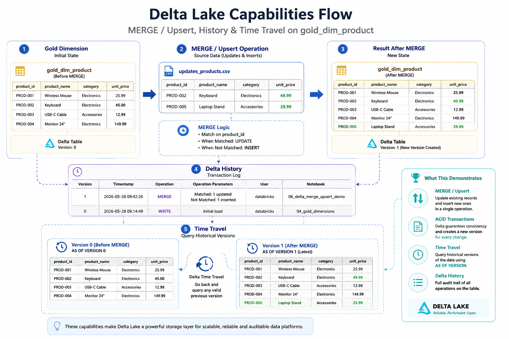

# Delta MERGE Upsert

This document describes the Delta MERGE / upsert pattern implemented in the `azure-databricks-delta-lakehouse` project.

The MERGE pattern is demonstrated using the Gold product dimension.

### 1. Delta MERGE Objective



The objective of the Delta MERGE implementation is to demonstrate how a Delta table can be updated incrementally instead of being fully overwritten.

In real data platforms, source data changes over time.

Examples:

```text
A product price changes.
A new product is added.
A customer record changes.
An order status is updated.
Reference data is corrected.
```

Delta MERGE supports this type of incremental table mutation.

In this project, MERGE is used to demonstrate an upsert pattern.

```text
upsert = update existing records + insert new records
```

### 2. Where MERGE Is Implemented

MERGE is implemented in the Gold layer.

Notebook:

```text
06_delta_merge_upsert_demo
```

Target table:

```text
gold_dim_product
```

Logical path:

```text
gold/delta_lakehouse/gold_dim_product
```

The target table is stored as a path-based Delta table in ADLS Gen2.

### 3. Why Product Dimension Is Used

The product dimension was selected for the MERGE demonstration because it is a simple and clear reference data table.

The table starts with four products.

The MERGE demo then applies a small update batch containing:

```text
PROD-002 → existing product with updated price
PROD-005 → new product
```

This creates an easy-to-understand before/after scenario.

### 4. Target Table

Target Delta table:

```text
gold_dim_product
```

Before MERGE, the table contains four products:

```text
PROD-001
PROD-002
PROD-003
PROD-004
```

After MERGE, the table should contain five products:

```text
PROD-001
PROD-002
PROD-003
PROD-004
PROD-005
```

### 5. MERGE Source Data

The MERGE source batch is created inside the notebook as a small DataFrame.

The source batch contains two records.

| Product ID | Scenario | Expected Action |
|---|---|---|
| `PROD-002` | Existing product with updated price | Update |
| `PROD-005` | New product | Insert |

#### Source Update Scenario

`PROD-002` already exists in the target table.

Original price:

```text
35.00
```

Updated price:

```text
38.00
```

The MERGE should update this existing product row.

#### Source Insert Scenario

`PROD-005` does not exist in the target table.

The MERGE should insert it as a new product row.

### 6. MERGE Business Logic

The MERGE condition uses the product business key.

```text
target.product_id = source.product_id
```

The MERGE applies two main actions:

```text
When matched and record changed → update
When not matched → insert
```

Conceptually:

```text
If product_id exists:
    update product attributes if changed

If product_id does not exist:
    insert new product
```

### 7. Change Detection

The project uses a `record_hash` to compare product attributes.

Tracked product attributes:

```text
product_name
category
unit_price
is_active
```

A hash is generated from these fields.

Conceptually:

```text
record_hash = sha2(product_name, category, unit_price, is_active)
```

The MERGE update only happens when:

```text
target.record_hash <> source.record_hash
```

This prevents unnecessary updates when the source record is identical to the target record.

### 8. MERGE Actions

#### Matched Update

If a product already exists and the product hash changed, the target row is updated.

Updated fields include:

```text
product_name
category
unit_price
is_active
record_hash
ingestion_batch_id
source_file_path
raw_record_hash
silver_processed_ts
gold_processed_ts
```

#### Not Matched Insert

If a product does not exist in the target table, a new row is inserted.

Inserted fields include:

```text
product_sk
product_id
product_name
category
unit_price
is_active
record_hash
ingestion_batch_id
source_file_path
raw_record_hash
silver_processed_ts
gold_processed_ts
```

### 9. MERGE Processing Flow

The notebook follows this sequence:

```text
Read gold_dim_product before MERGE
      ↓
Create product update source batch
      ↓
Prepare source records with product_sk and record_hash
      ↓
Load target table as DeltaTable
      ↓
Execute MERGE
      ↓
Read gold_dim_product after MERGE
      ↓
Validate total and distinct product counts
      ↓
Inspect Delta history for MERGE operation
```

### 10. DeltaTable API

The notebook uses the Delta Lake `DeltaTable` API.

Conceptually:

```python
target_delta_table = DeltaTable.forPath(spark, gold_dim_product_path)
```

This loads the target table using its physical ADLS Gen2 path.

The project uses path-based Delta tables instead of catalog-registered tables.

### 11. MERGE Pattern

The MERGE pattern is conceptually equivalent to:

```text
target MERGE source
ON target.product_id = source.product_id

WHEN MATCHED AND changed THEN UPDATE
WHEN NOT MATCHED THEN INSERT
```

This is a common pattern for maintaining dimensions and reference data in modern Lakehouse pipelines.

### 12. Expected Result

After the MERGE runs, the product dimension should contain five distinct products.

Expected row count validation:

| Metric | Expected value |
|---|---:|
| Total products | 5 |
| Distinct product IDs | 5 |

Expected product-level behavior:

| Product | Expected result |
|---|---|
| `PROD-002` | Existing product updated |
| `PROD-005` | New product inserted |

### 13. PROD-002 Update Validation

Before MERGE:

```text
PROD-002 | Ice Bag 5kg | unit_price = 35.00
```

After MERGE:

```text
PROD-002 | Ice Bag 5kg | unit_price = 38.00
```

This validates the update side of the upsert.

### 14. PROD-005 Insert Validation

Before MERGE:

```text
PROD-005 does not exist
```

After MERGE:

```text
PROD-005 | Ice Bag 10kg | unit_price = 62.00
```

This validates the insert side of the upsert.

### 15. Delta History Validation

After the MERGE runs, the notebook checks Delta table history.

Expected operation:

```text
MERGE
```

This confirms that the table was not simply overwritten.

It was mutated through a Delta transaction.

The validation checks that Delta history contains at least one MERGE operation.

### 16. Why Delta History Matters

Delta history is important because it shows table-level operations over time.

For this project, history helps prove that:

- The target table existed before the MERGE.
- A MERGE operation was executed.
- Delta Lake recorded the operation transactionally.
- The table version changed after the MERGE.

This supports auditability and debugging.

### 17. Relationship to Time Travel

The MERGE notebook creates a before/after scenario used by the time travel notebook.

Notebook:

```text
07_time_travel_validation
```

The time travel notebook reads the product dimension at different Delta versions.

Expected comparison:

```text
Before MERGE → 4 products
After MERGE  → 5 products
```

It also validates:

```text
PROD-002 changed from 35.00 to 38.00
PROD-005 did not exist before MERGE
PROD-005 exists after MERGE
```

The MERGE and time travel notebooks together demonstrate Delta Lake versioning and table mutation.

### 18. MERGE Idempotency Consideration

The MERGE logic uses product business key and record hash comparison.

This means re-running the MERGE should not create duplicate product IDs.

Expected behavior on rerun:

```text
PROD-002 remains updated.
PROD-005 remains inserted.
No duplicate product IDs are created.
```

The table should still contain:

```text
5 total products
5 distinct product IDs
```

The Delta table version may increase if the operation is executed again, but the business result should remain consistent.

### 19. Validation in Final QA Notebook

The final validation notebook verifies MERGE results.

Notebook:

```text
08_data_quality_validation
```

MERGE-related validations include:

```text
gold_dim_product_no_duplicate_product_id
delta_merge_updated_existing_product
delta_merge_inserted_new_product
gold_dim_product_delta_history_contains_merge
```

Expected results:

| Validation | Expected result |
|---|---|
| No duplicate product IDs | PASS |
| `PROD-002` updated to `38.00` | PASS |
| `PROD-005` inserted | PASS |
| Delta history contains MERGE | PASS |

### 20. MERGE Evidence

Recommended evidence for Delta MERGE is defined in:

```text
docs/evidence_index.md
```

Relevant evidence folder:

```text
evidence/07_delta_merge/
```

Recommended evidence files:

| Evidence file | Purpose |
|---|---|
| `01_product_dimension_before_merge.png` | Shows product dimension before MERGE |
| `02_merge_source_batch.png` | Shows source records used for MERGE |
| `03_product_dimension_after_merge.png` | Shows product dimension after MERGE |
| `04_merge_row_count_validation.png` | Shows total and distinct product counts |
| `05_delta_history_merge_operation.png` | Shows MERGE operation in Delta history |

### 21. MERGE Design Decisions

#### Use Product Dimension as Target

The product dimension provides a simple and clear upsert scenario.

#### Use Product ID as Business Key

`product_id` is the natural business key for matching source and target records.

#### Use Record Hash for Change Detection

The record hash prevents unnecessary updates when tracked attributes have not changed.

#### Use DeltaTable API

The notebook uses the Delta Lake API to execute MERGE against a path-based Delta table.

#### Keep Product Dimension Current-State

The product dimension is not implemented as SCD Type 2 in the MVP.

This keeps the MERGE demonstration focused and avoids mixing two history patterns in the same table.

### 22. Why MERGE Is Important in Data Engineering

MERGE is important because many real data pipelines receive changes, not only new records.

Common examples:

```text
Reference data updates
Order status changes
Customer attribute changes
Product price changes
Late-arriving corrections
```

Without MERGE, a pipeline may need to overwrite full tables repeatedly.

With MERGE, a pipeline can apply incremental changes to Delta tables.

This is especially useful for dimensional tables, snapshots, and slowly changing reference data.

### 23. MERGE vs Overwrite

The project uses overwrite in earlier notebooks to keep the MVP reproducible during development.

However, overwrite does not demonstrate incremental mutation.

MERGE demonstrates a different pattern.

| Pattern | Use Case |
|---|---|
| Overwrite | Rebuild controlled demo outputs |
| MERGE | Apply incremental updates and inserts |

Both patterns are valid depending on context.

This project includes both to show the difference.

### 24. Path-Based MERGE

The MERGE is executed against a path-based Delta table.

This means the target table is identified by its ADLS Gen2 location rather than by a catalog name.

Example:

```text
abfss://gold@<storage-account>.dfs.core.windows.net/delta_lakehouse/gold_dim_product
```

This matches the MVP scope, which focuses on Delta Lake processing without introducing a full Unity Catalog governance design.

### 25. Security Considerations

The MERGE notebook does not contain storage account keys or connection strings.

ADLS Gen2 access is configured at the Databricks compute level using a Databricks-backed secret scope.

The notebook only references logical paths and Delta APIs.

This keeps the code safe for a public GitHub repository.

### 26. Known Limitations

This MERGE implementation is intentionally scoped for an MVP.

Known limitations:

- It uses a small manually created source batch.
- It does not read MERGE changes from an external operational source.
- It does not implement product SCD Type 2.
- It does not handle deletes.
- It does not implement soft deletes.
- It does not implement late-arriving updates.
- It does not use a configurable merge framework.
- It does not use Unity Catalog registered tables.
- It does not orchestrate MERGE through Databricks Jobs.

These limitations are acceptable for the current project scope.

### 27. Future Enhancements

Possible future enhancements include:

- Reading MERGE source data from landing or Silver incrementally
- Implementing soft delete handling
- Adding delete support when source records are removed
- Creating a reusable merge utility function
- Extending MERGE to customer or order snapshot tables
- Implementing product SCD Type 2
- Registering Delta tables in Unity Catalog
- Running MERGE through Databricks Jobs
- Adding automated test assertions for MERGE outcomes

### 28. MERGE Summary

The Delta MERGE implementation demonstrates an incremental upsert pattern on the Gold product dimension.

It validates that:

- Existing records can be updated.
- New records can be inserted.
- Business keys remain unique.
- Delta history records the MERGE operation.
- Time travel can compare before and after states.
- Final validation confirms the MERGE results.

This pattern is one of the key Delta Lake capabilities demonstrated by the project.