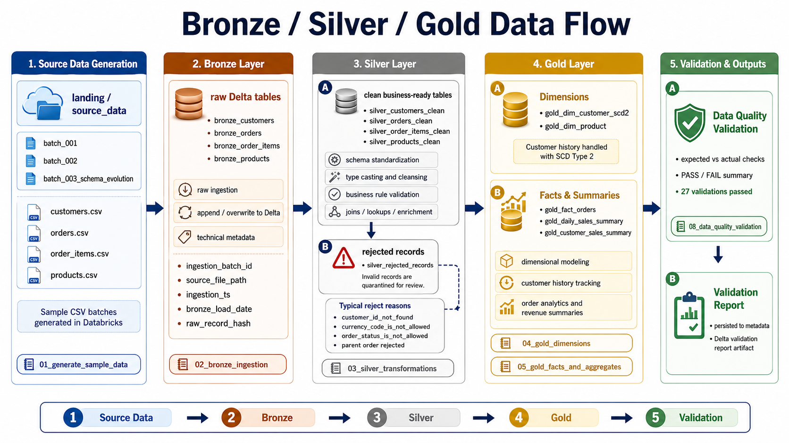

# Lakehouse Design

This document explains the Lakehouse design used in the `azure-databricks-delta-lakehouse` project.

The goal is to describe why the project uses a Bronze/Silver/Gold architecture, how each layer contributes to data reliability, and how Delta Lake supports versioned and analytics-ready data processing.

### 1. Design Objective



The Lakehouse design objective is to transform raw source files into trusted analytical tables through a clear and traceable data lifecycle.

The project follows this logical flow:

```text
Landing → Bronze → Silver → Gold → Validation
```

Each layer has a specific purpose:

| Layer | Main Purpose |
|---|---|
| Landing | Store source files before processing |
| Bronze | Preserve raw data with technical metadata |
| Silver | Clean, type, validate, and reject invalid records |
| Gold | Build analytics-ready dimensions, facts, and summaries |
| Metadata | Store validation reports and project-level outputs |

The design demonstrates practical Lakehouse engineering patterns without introducing unnecessary production complexity.

### 2. Why Lakehouse

A Lakehouse combines the flexibility of a Data Lake with table-oriented processing patterns commonly associated with a Data Warehouse.

In this project, ADLS Gen2 provides the storage layer, while Delta Lake provides table reliability features over files.

This allows the project to work with data as:

```text
Files in the Data Lake
```

and also as:

```text
Delta tables with schema, history, versioning, and transactional operations
```

#### Lakehouse Benefits Demonstrated

The project demonstrates the following Lakehouse benefits:

- Separation of raw, clean, and analytical data
- Traceable data movement across layers
- Delta table transaction logs
- Versioned table reads
- MERGE / upsert operations
- Rejected record handling
- Analytical model construction
- Data quality validation
- Reproducible execution through notebooks

### 3. Why Bronze, Silver, and Gold

The Bronze/Silver/Gold pattern creates a simple and explainable structure for managing data quality and analytical readiness.

Each layer increases the level of trust and business usability.

```text
Bronze = preserve what arrived
Silver = validate and clean what can be trusted
Gold   = model what can be consumed
```

This pattern keeps the pipeline understandable and helps separate technical concerns from analytical concerns.

#### Layer Responsibility Summary

| Layer | Data State | Main User |
|---|---|---|
| Bronze | Raw but traceable | Data engineers |
| Silver | Clean and validated | Data engineers / analytics engineers |
| Gold | Business-ready | Analysts / BI / reporting users |

### 4. Landing Layer Design

The landing layer stores the original source files generated by the project.

Path pattern:

```text
landing/source_data/
  batch_001/
  batch_002/
  batch_003_schema_evolution/
```

The landing layer represents the source arrival area.

It is intentionally simple because the project focuses on Databricks and Delta Lake processing rather than ingestion orchestration.

#### Landing Responsibilities

The landing layer is responsible for:

- Storing source CSV files
- Preserving source batch separation
- Providing reproducible inputs for the Lakehouse pipeline
- Supporting controlled test scenarios

#### Source Batch Design

The source batches were designed to demonstrate realistic data conditions.

| Batch | Purpose |
|---|---|
| `batch_001` | Initial baseline data |
| `batch_002` | Incremental updates and invalid references |
| `batch_003_schema_evolution` | Schema evolution and additional invalid values |

### 5. Bronze Layer Design

The Bronze layer converts landing CSV files into Delta tables.

Bronze tables:

```text
bronze_customers
bronze_products
bronze_orders
bronze_order_items
```

The Bronze layer keeps data close to the source while adding technical metadata.

It does not apply strict business validation.

#### Bronze Responsibilities

Bronze is responsible for:

- Reading source files from landing
- Preserving original source records
- Combining multiple batches by entity
- Adding ingestion metadata
- Preserving schema evolution where applicable
- Writing source data as Delta tables

#### Bronze Metadata

The Bronze layer adds the following technical metadata:

| Column | Purpose |
|---|---|
| `ingestion_batch_id` | Identifies the source batch |
| `source_entity` | Identifies the entity being processed |
| `source_file_path` | Stores the source file path |
| `ingestion_ts` | Captures ingestion timestamp |
| `bronze_load_date` | Captures load date |
| `raw_record_hash` | Generates a fingerprint for the raw record |

This metadata supports traceability from later layers back to source files.

#### Why Bronze Keeps Invalid Records

Bronze intentionally keeps invalid business records.

Examples of invalid records preserved in Bronze include:

```text
Unsupported currency code
Invalid order status
Invalid customer reference
Invalid order item parent reference
Negative quantity
```

This is intentional because Bronze acts as the raw historical record of what arrived.

Invalid records are handled later in Silver.

### 6. Silver Layer Design

The Silver layer transforms Bronze Delta tables into clean, typed, and validated datasets.

Silver clean tables:

```text
silver_customers_clean
silver_products_clean
silver_orders_clean
silver_order_items_clean
```

Rejected records table:

```text
silver_rejected_records
```

Silver acts as the quality gate of the Lakehouse.

#### Silver Responsibilities

Silver is responsible for:

- Casting data to expected data types
- Cleaning strings
- Applying required-field checks
- Applying allowed-value checks
- Applying referential validation
- Calculating business fields such as line totals
- Separating rejected records
- Producing trusted tables for Gold processing

#### Silver Quality Philosophy

The Silver layer does not silently discard invalid records.

Instead, it separates them into a rejected-records table.

This keeps the pipeline transparent and auditable.

```text
Valid records   → Silver clean tables
Invalid records → Silver rejected records
```

#### Rejected Records Design

The `silver_rejected_records` table normalizes invalid records across entities.

It includes:

| Column | Purpose |
|---|---|
| `entity_name` | Entity that failed validation |
| `reject_reason` | First validation reason detected |
| `ingestion_batch_id` | Source batch |
| `source_file_path` | Original source file path |
| `raw_record_hash` | Raw record fingerprint |
| `rejected_at` | Rejection timestamp |
| `record_json` | Rejected row payload |

This design allows the project to demonstrate data quality handling without losing invalid data visibility.

### 7. Gold Layer Design

The Gold layer creates analytics-ready tables.

Gold tables:

```text
gold_dim_customer_scd2
gold_dim_product
gold_fact_orders
gold_daily_sales_summary
gold_customer_sales_summary
```

Gold is designed for analytical consumption and business reporting patterns.

#### Gold Responsibilities

Gold is responsible for:

- Building dimensions
- Building fact tables
- Preserving customer history
- Handling updated order states
- Creating analytical summaries
- Preparing data for downstream consumption
- Demonstrating Delta MERGE and time travel

#### Gold Modeling Approach

The Gold model uses a dimensional structure.

It includes:

| Table | Type | Purpose |
|---|---|---|
| `gold_dim_customer_scd2` | Dimension | Preserves customer history |
| `gold_dim_product` | Dimension | Stores product attributes |
| `gold_fact_orders` | Fact | Stores order-level metrics |
| `gold_daily_sales_summary` | Aggregate | Summarizes sales by date and currency |
| `gold_customer_sales_summary` | Aggregate | Summarizes sales by customer and currency |

### 8. SCD Type 2 Design

The project implements SCD Type 2 for the customer dimension.

Table:

```text
gold_dim_customer_scd2
```

SCD Type 2 preserves historical changes instead of overwriting customer records.

#### Why SCD Type 2 Is Used

Customer attributes can change over time.

Examples:

```text
Customer changes city
Customer changes segment
Customer changes email
Customer gains loyalty tier
```

For analytical reporting, it may be important to know which customer version was active when a transaction happened.

#### Tracked Attributes

The project tracks the following customer attributes:

```text
customer_name
email
city
state
customer_segment
loyalty_tier
```

#### SCD Type 2 Columns

| Column | Purpose |
|---|---|
| `customer_sk` | Surrogate key |
| `customer_id` | Business key |
| `effective_start_ts` | Version start timestamp |
| `effective_end_ts` | Version end timestamp |
| `is_current` | Indicates active version |
| `record_hash` | Hash of tracked business attributes |

#### Versioning Logic

The notebook compares the current record hash against the previous record hash for each customer.

If the hash changes, a new customer version is created.

```text
Same hash      → no new version
Different hash → create new SCD2 version
```

The latest customer version has:

```text
effective_end_ts = null
is_current = true
```

Older versions have:

```text
effective_end_ts populated
is_current = false
```

### 9. Fact Table Design

The `gold_fact_orders` table stores one row per valid order.

It is built from:

```text
silver_orders_clean
silver_order_items_clean
gold_dim_customer_scd2
```

#### Latest Order State

Some orders appear in multiple batches because their status changed.

Example:

```text
ORD-1002 appears in batch_001 and batch_002
```

The fact table keeps the latest valid state for each order.

This prevents double-counting updates as new business transactions.

#### Fact Metrics

The fact table includes metrics such as:

- Order line count
- Total quantity
- Gross order amount
- Total discount amount
- Net order amount
- Recognized revenue amount

#### Revenue Recognition Flag

The project treats the following statuses as revenue-generating:

```text
PAID
COMPLETED
```

Other statuses, such as `CREATED` or `CANCELLED`, are not counted as recognized revenue.

### 10. SCD2 As-Of Join Design

The fact table joins orders to the customer dimension using an as-of join.

This means the order is linked to the customer version that was valid when the order occurred.

Conceptual logic:

```text
order_ts >= effective_start_ts
and order_ts < effective_end_ts
```

For current customer records:

```text
effective_end_ts is null
```

This design is important because it prevents all historical orders from being incorrectly tied to the latest customer attributes.

#### Example

If a customer changed segment after an order was placed, the order should still be associated with the customer segment that was active at the time of the order.

This supports historically accurate analytics.

### 11. Analytical Summary Design

The Gold layer includes two summary tables.

```text
gold_daily_sales_summary
gold_customer_sales_summary
```

#### Daily Sales Summary

The daily summary groups orders by:

```text
order_date
currency_code
```

It includes order counts, status counts, quantities, sales amounts, discounts, and recognized revenue.

#### Customer Sales Summary

The customer summary groups sales by customer and currency.

It includes:

- Total orders
- Revenue orders
- Quantity totals
- Gross sales amount
- Discount amount
- Net order amount
- Recognized revenue amount
- First order date
- Last order date

These summaries demonstrate how Gold tables can support reporting and BI-style consumption.

### 12. Delta Lake Design

Delta Lake is used as the table format for Bronze, Silver, Gold, and metadata outputs.

Delta provides the foundation for:

- Transaction logs
- Versioned table history
- MERGE operations
- Time travel reads
- Reliable table writes
- Schema handling

#### Delta Table Layout

The project writes Delta tables into ADLS Gen2 paths.

Example:

```text
gold/delta_lakehouse/gold_fact_orders/
  _delta_log/
  part-...
```

The `_delta_log` directory stores the transaction history for each Delta table.

#### Path-Based Delta Tables

The project uses path-based Delta tables.

Example:

```python
spark.read.format("delta").load(gold_fact_orders_path)
```

This keeps the project focused on Delta Lake concepts without requiring a production catalog or governance setup.

### 13. MERGE / Upsert Design

The project demonstrates Delta MERGE using the product dimension.

Target:

```text
gold_dim_product
```

Source update scenario:

```text
PROD-002 → existing product with updated price
PROD-005 → new product
```

Expected behavior:

```text
PROD-002 → update existing row
PROD-005 → insert new row
```

This demonstrates an upsert pattern.

```text
upsert = update + insert
```

#### Why MERGE Matters

In real data platforms, source data frequently changes.

Examples:

- Product price changes
- Customer records change
- Order statuses change
- Reference data is added

MERGE allows a Delta table to be updated incrementally without rebuilding the entire table from scratch.

### 14. Time Travel Design

The project validates Delta time travel using the product dimension before and after MERGE.

Expected comparison:

```text
Before MERGE → 4 products
After MERGE  → 5 products
```

The time travel notebook also validates:

```text
PROD-002 price before MERGE → 35.00
PROD-002 price after MERGE  → 38.00
PROD-005 before MERGE       → not present
PROD-005 after MERGE        → present
```

This demonstrates that Delta table versions can be queried to validate prior states.

#### Why Time Travel Matters

Time travel supports:

- Debugging
- Reproducibility
- Audit-style validation
- Before/after comparisons
- Understanding the impact of data mutations

It is not treated as a replacement for a formal backup and disaster recovery strategy.

### 15. Validation Design

The final validation notebook checks that the Lakehouse outputs are internally consistent.

Notebook:

```text
08_data_quality_validation
```

The validation process checks:

- Expected row counts
- Expected rejected records
- Duplicate prevention
- SCD2 current-record rules
- Valid SCD2 effective dates
- Product MERGE results
- Delta MERGE history
- Fact-to-dimension joins
- Revenue consistency between fact and summary

Validation results are persisted to:

```text
metadata/delta_lakehouse/validation_reports/
```

#### Validation Philosophy

The project does not stop at building tables.

It also verifies that the produced outputs match expected business and technical rules.

This improves trust in the pipeline and creates evidence for documentation.

### 16. Secure Access Design

The project avoids storing credentials in notebooks.

ADLS Gen2 access is configured using:

```text
Databricks-backed secret scope
Compute-level Spark configuration
```

The notebooks do not include:

```text
Storage account keys
Connection strings
Plaintext credentials
Personal access tokens
```

This design keeps the repository safe for public GitHub publication.

### 17. Git-Integrated Design

The project uses GitHub and Databricks Git Folder integration.

```text
VS Code local repo ↔ GitHub remote repo ↔ Databricks Git Folder
```

This design allows:

- Markdown editing in VS Code
- Notebook execution in Databricks
- Source control through GitHub
- Public documentation through the repository
- Cleaner synchronization between local and cloud execution environments

#### Operating Model

Recommended operating model:

```text
Edit documentation in VS Code
Commit and push to GitHub
Pull changes into Databricks Git Folder
Run notebooks in Databricks
Commit notebook changes from Databricks only when needed
Pull Databricks changes back into VS Code
```

### 18. Cost-Aware Design

The Lakehouse design is intentionally cost-aware.

Cost-control decisions include:

- Small sample datasets
- Single-node Personal Compute
- Auto-termination
- Manual compute termination after work sessions
- No always-on workloads
- No scheduled jobs for the MVP
- No SQL Warehouse for the MVP
- No pools for the MVP
- No Event Hubs
- No streaming workloads

The project accepts startup latency as a trade-off for lower idle cost.

### 19. Scope Boundaries

This project is a focused MVP.

It intentionally avoids production-level scope such as:

- Unity Catalog governance design
- Azure Key Vault-backed secret scope
- Databricks Jobs orchestration
- CI/CD deployment automation
- Production monitoring and alerting
- Delta Live Tables / Lakeflow pipelines
- Streaming ingestion
- Data catalog and lineage tooling
- External BI semantic model

These capabilities can be added in future iterations.

### 20. Design Summary

The Lakehouse design converts raw source files into validated and analytics-ready Delta tables.

The project demonstrates:

- Landing source data
- Bronze raw Delta tables
- Silver clean and rejected records
- Gold dimensions, facts, and summaries
- SCD Type 2 customer history
- Fact-to-dimension historical joins
- Delta MERGE / upsert
- Delta time travel
- Final validation reporting
- Secure credential handling
- Git-integrated Databricks execution
- Cost-aware development

This design provides a practical and technically defensible demonstration of Azure Databricks Lakehouse engineering.